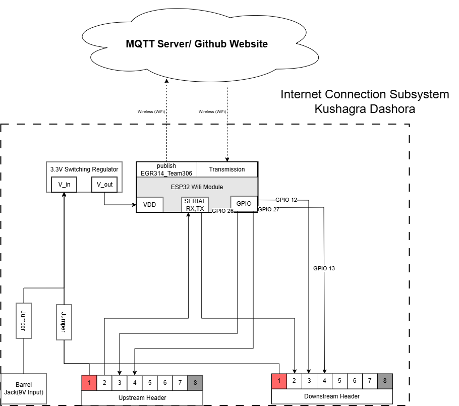

## Final Block Diagram

Here is the updated and finalized block diagram for the Internet Communication Subsystem:

[Download Subsystem Block Diagram PDF](./subfolder/KD_Block_Diagram.pdf)

## Design Explanation

This updated block diagram represents the finalized design of the Internet Communication Subsystem, incorporating all feedback and refinements made throughout the project development cycle. 

Key updates include:
- Updated GPIO connections: **GPIO 35, 38, 43, and 44** are now designated for serial and digital communications between the ESP32 and other headers.
- Simplified wiring structure with better separation of upstream and downstream communication.
- Clearer labeling of power flow from the **9V barrel jack**, through a **3.3V switching regulator**, and into the ESP32 WiFi module.

## Decision-Making Process

Our goal from the start was to establish a stable and efficient wireless communication pipeline between the environmental sensor subsystems and an external MQTT server/GitHub-hosted dashboard. 

The **ESP32-S3-WROOM-1-N4** was selected for its low-power wireless connectivity, integration ease, and support for MQTT protocol. GPIOs were chosen based on their digital I/O functionality and UART compatibility, and adjusted after prototype testing for best performance.

We used a **3.3V switching regulator** to safely convert the 9V barrel jack input to a level suitable for the ESP32. The use of **jumpers and headers** ensures modularity and ease of debugging during subsystem integration.

## Product Requirement Alignment

This design satisfies the Internet Communication Subsystem’s functional and electrical requirements:
- **Wi-Fi-enabled MQTT publishing** of sensor data to a cloud server or GitHub-hosted website.
- **Reliable UART and GPIO-based communication** with both upstream and downstream subsystems.
- **Regulated power delivery** using a dedicated voltage regulator.
- **Scalable and modular system design** using upstream/downstream headers to support other student-designed subsystems.

This final version is optimized for both functionality and maintainability in real-world classroom and demo environments.
