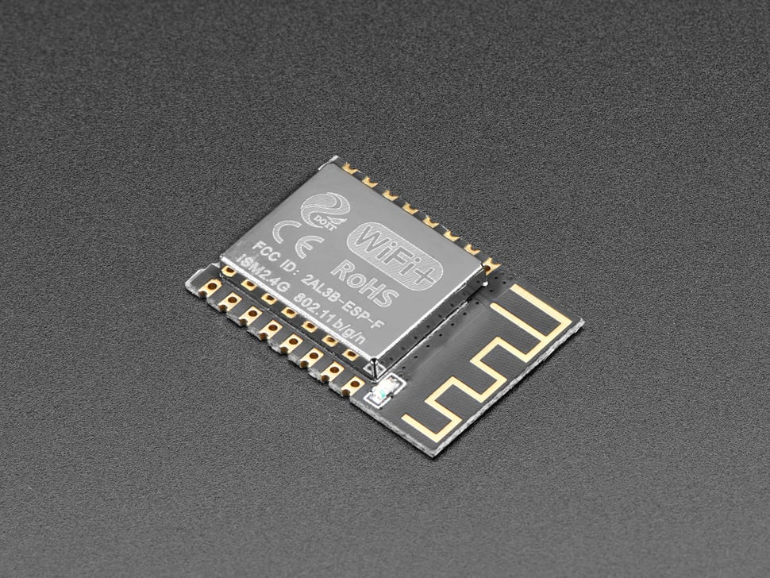
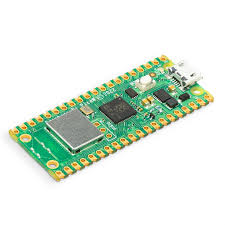
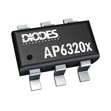
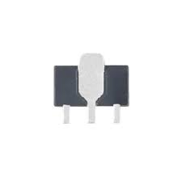
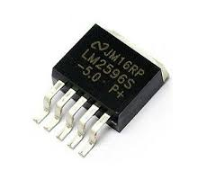
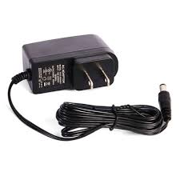

# Subsystem Documentation: Wi-Fi-Enabled Data Collection and Transmission

## **Introduction**
As part of our embedded systems design project, my subsystem is responsible for collecting data from all sensors in the system, transmitting it via a Wi-Fi network created by the ESP32 microcontroller, and updating this data in real-time on a GitHub-hosted webpage. This document outlines the selection of components for my subsystem, focusing on efficient power regulation, reliable wireless communication, and seamless integration with sensors.

---

## **Final Major Component Summary**

| Component Name                | Role                                      | Final Part Number / ID         | Justification                             |
|------------------------------|-------------------------------------------|--------------------------------|-------------------------------------------|
| ESP32-S3-WROOM-1-N4          | Wi-Fi-enabled microcontroller             | ESP32-S3-WROOM-1-N4            | Best balance of Wi-Fi support, power, GPIO |
| AP63203WU-7                  | 3.3V Switching Voltage Regulator          | AP63203WU-7                    | High-efficiency regulator for 9V–3.3V     |
| DC Barrel Jack Adapter       | Power input interface                     | PRT-10811                      | Reliable power input from wall adapter    |

---

## **Major Component Selections**

### **Microcontroller Selection**

| **Option**               | **Pros**                                                                 | **Cons**                                                       | **Unit Cost & Link**                                                                 |
|---------------------------|-------------------------------------------------------------------------|----------------------------------------------------------------|-------------------------------------------------------------------------------------|
|    **ESP32-S3-WROOM-1-N4 (Final Choice)**  | Built-in Wi-Fi/Bluetooth, supports multiple serial protocols, low power modes, 4MB Flash | 3.3V logic may require level shifters for some peripherals      | [$2.95 DigiKey](https://www.digikey.com/en/products/detail/espressif-systems/ESP32-S3-WROOM-1-N4/16162639) |
|    **ESP8266**                 | Low cost, simple to use                                                 | Limited GPIO pins, no dual-core processor                      | [$1.60 DigiKey](https://www.digikey.com/en/products/detail/espressif-systems/ESP8266EX/8028401) |
|    **Raspberry Pi Pico W**      | Dual-core processor, Wi-Fi support                                      | Higher power consumption, larger physical size                 | [$6.00 DigiKey](https://www.digikey.com/en/products/detail/raspberry-pi/SC0918/16627943) |

**Final Selection: ESP32-S3-WROOM-1-N4**  
*Rationale:* Chosen for its robust Wi-Fi support, multiple GPIOs, dual-core processor, and strong developer ecosystem.

---

### **Power Regulation**

| **Option**           | **Pros**                                                  | **Cons**                                   | **Unit Cost & Link**                                                                 |
|-----------------------|----------------------------------------------------------|-------------------------------------------|-------------------------------------------------------------------------------------|
|    **AP63203WU_7 (Final Choice)**    | High efficiency, compact size, low quiescent current  | Slightly higher cost than linear regulators | [$1.38 DigiKey](https://www.digikey.com/en/products/detail/diodes-incorporated/AP63203WU-7/9858426) |
|    **AMS1117-3.3**           | Simple design                                            | Low efficiency                            | [$0.68 DigiKey](https://www.digikey.com/en/products/detail/umw/AMS1117-3-3/17635254) |
|    **LM2596**                | High efficiency                                          | Larger physical size                      | [$6.70 DigiKey](https://www.digikey.com/en/products/detail/texas-instruments/LM2596S-ADJ-NOPB/363705) |

**Final Selection: AP63203WU_7**  
*Rationale:* Offers high efficiency, surface mount compatibility, and ideal size for our compact PCB design.

---

### **Power Input**

| **Option**           | **Pros**                                                  | **Cons**                                   | **Unit Cost & Link**                                                                 |
|-----------------------|----------------------------------------------------------|-------------------------------------------|-------------------------------------------------------------------------------------|
|    **DC Barrel Jack Adapter (Final Choice)**  | Simple, reliable, provides stable power  | Requires external adapter | [$1.50 DigiKey](https://www.digikey.com/en/products/detail/sparkfun-electronics/PRT-10811/1631950) |

**Final Selection: DC Barrel Jack Adapter**  
*Rationale:* Easy to implement and provides reliable power supply with no need for USB tethering.

---

## **Additional Components to Enhance Subsystem**

1. **Capacitors (Decoupling):**
   - Add 10µF and 0.1µF near ESP32 and regulator to suppress noise.
2. **Heat Sink (Optional):**
   - Use with voltage regulator if temperatures rise during sustained load.
3. **LED Indicators:**
   - Power LED and Wi-Fi status LED to debug and verify connectivity visually.

---

## **Responsibilities**

1. **Data Collection:** Collect sensor data over UART using GPIO 43 (TX) and GPIO 44 (RX).
2. **Wi-Fi Communication:** Use the ESP32 Wi-Fi module to transmit sensor data to the MQTT broker.
3. **Power Management:** Convert 9V input to stable 3.3V using AP63203WU_7 regulator.
4. **Live Data Updates:** Send data to GitHub-hosted webpage for real-time visualization.
5. **System Integration:** Communicate with both upstream and downstream subsystems via GPIO 35 and 38.

---

## **Updated ESP32 Pinout Table**

| **Pin**   | **Function**               | **Connected To**                  | **Subsystem**                |
|-----------|----------------------------|----------------------------------|------------------------------|
| GPIO 35   | Digital I/O                | Downstream Header                | Communication Interface      |
| GPIO 38   | Digital I/O                | Upstream Header                  | Communication Interface      |
| GPIO 43   | UART TX                    | Sensor Subsystem                 | Data Collection              |
| GPIO 44   | UART RX                    | Sensor Subsystem                 | Data Collection              |
| VDD       | Power (3.3V)               | From Switching Regulator         | Power Supply                 |
| GND       | Ground                     | Common Ground Plane              | Power Supply                 |

---

## **Decision-Making Process for Pinout Configuration**

The pin mapping was finalized after evaluating GPIO availability, electrical constraints, and subsystem routing complexity. The following guided our process:

- Selecting **dedicated UART pins** (GPIO 43 and 44) to prevent serial conflicts.
- Ensuring **digital I/O pins (GPIO 35, 38)** were free from boot or flash limitations.
- Prioritizing **clean PCB routing paths** for all signal and power lines.
- Testing UART behavior under full sensor load to ensure reliability.

This structure ensures minimal interference and maximum compatibility with sensor data flow and inter-subsystem signaling.

---

## **How Design Meets Product Requirements**

Our design meets all defined requirements:

- ✅ **Wireless Transmission:** ESP32’s native Wi-Fi and MQTT support provide real-time updates to GitHub webpage.
- ✅ **UART-Based Sensor Collection:** Pinout isolates UART pins to prevent conflicts.
- ✅ **Reliable Power Supply:** Barrel jack and AP63203WU_7 ensure stable and safe 3.3V operation.
- ✅ **Modularity:** GPIOs connected to upstream/downstream headers simplify integration with other teams’ subsystems.
- ✅ **Efficiency and Debuggability:** LED indicators and compact switching regulator improve usability and maintainability.

---

## **Conclusion**

The final component and pin configuration guarantees a robust, modular, and power-efficient Wi-Fi subsystem capable of real-time environmental data collection and wireless display. Careful pin allocation and component selection directly support reliability, integration, and long-term maintainability of the system.
