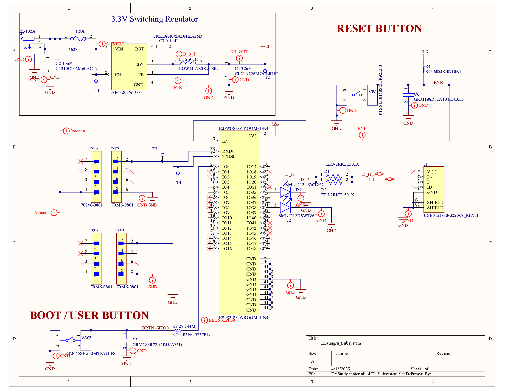
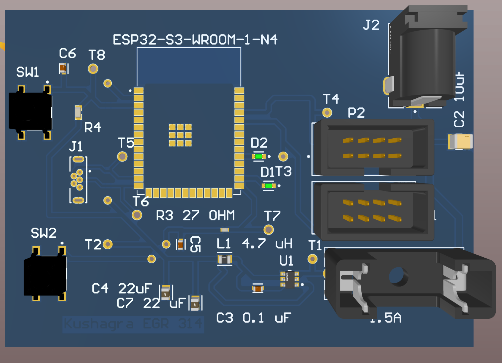
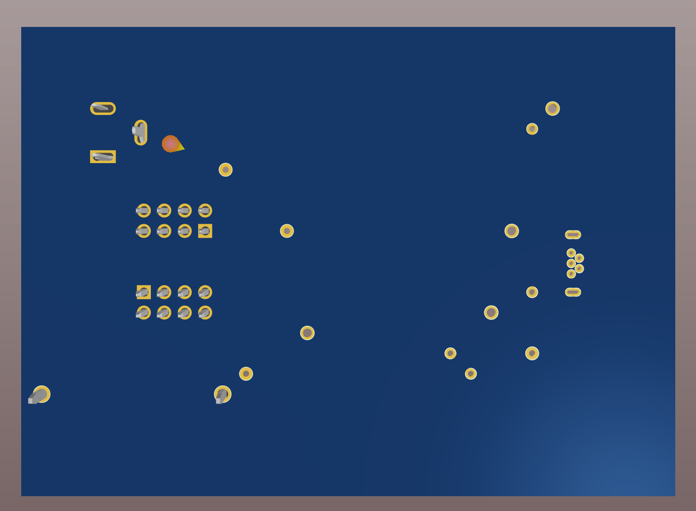
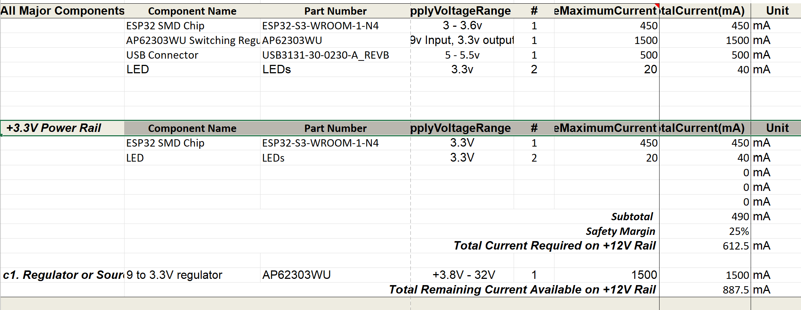

## Schematic 
Here is the finalized schematic for the Internet Communication Subsystem:  

[Download Subsystem Schematic PDF](./subfolder/KD_Subsystem.pdf)  
[Download Subsystem Project Zip](./subfolder/EGR314_KD_Subsystem.zip)

---

## PCB Fabrication

### Final Fabricated PCB (Front)

### Final Fabricated PCB (Back)

[Download Gerber Files (ZIP)](./subfolder/KD_PCB_Gerbers.zip)

---

## Power Budget

Here is the Power Budget for the Internet Communication Subsystem:

### Power Budget Analysis

To estimate our power needs, we calculated the maximum current draw from all components that operate on the 3.3V rail supplied by the AP63203WU regulator. The ESP32-S3-WROOM-1-N4 was the dominant power consumer (450 mA peak during Wi-Fi transmission), followed by minor contributions from the indicator LEDs.

The regulator chosen supports up to 1500 mA of current output, leaving us with a healthy **safety margin** even during peak operation. This ensures thermal efficiency, prevents brown-outs, and allows headroom for future expansions.

**Conclusion:**  
The power budget confirms our regulator selection is more than sufficient and offers protection from overcurrent scenarios, validating the electrical stability of our subsystem.

---

## Functionality and Design Justification

This schematic was created to satisfy both the **user needs** and the **technical product requirements**. These include:

- **Real-time sensor data collection** via UART communication,
- **Wireless data transmission** using the ESP32’s Wi-Fi capability to update a GitHub-hosted webpage,
- **Stable voltage regulation** using a high-efficiency switching regulator,
- **System integration** via upstream/downstream headers for communication with other subsystems.

**Functional Highlights:**
- The ESP32 handles UART and GPIO interfacing, while also maintaining a non-blocking Wi-Fi transmission loop.
- A 3.3V power rail feeds all digital logic components without needing level shifters.
- LED indicators were added to give real-time feedback on power and network status.

---

## Design Process and Team Decision-Making

The schematic and PCB layout evolved through iterative prototyping and weekly team meetings. Key decisions were based on:

- ESP32 pinout conflicts during UART usage (resolved by selecting GPIO 43/44),
- Heat concerns under continuous transmission (solved using a switching regulator instead of a linear one),
- Simplification of routing by aligning headers symmetrically to upstream/downstream edges,
- Collaborative reviews to ensure all connector orientations, silkscreens, and test pads were accessible.

Feedback from mentors emphasized **modularity**, which drove the header-based design allowing plug-and-play across team boards.

---

## Future Improvements (Hardware Design v2.0)

If we were to redesign our board for **Version 2.0**, the following enhancements would be made:

1. **Add ESD protection diodes** on UART/GPIO lines to prevent static damage during field testing.
2. **Include programming headers** or exposed test points for easier debugging without removing the board from the enclosure.
3. **Redesign footprint placements** to reduce trace length between regulator and ESP32 for improved power integrity.
4. **Add onboard reset and boot buttons** for easier flashing during development.
5. **Use a larger copper pour** for GND to improve heat dissipation during Wi-Fi peak load.

These improvements would enhance durability, reduce development friction, and improve overall board manufacturability and serviceability.

---

